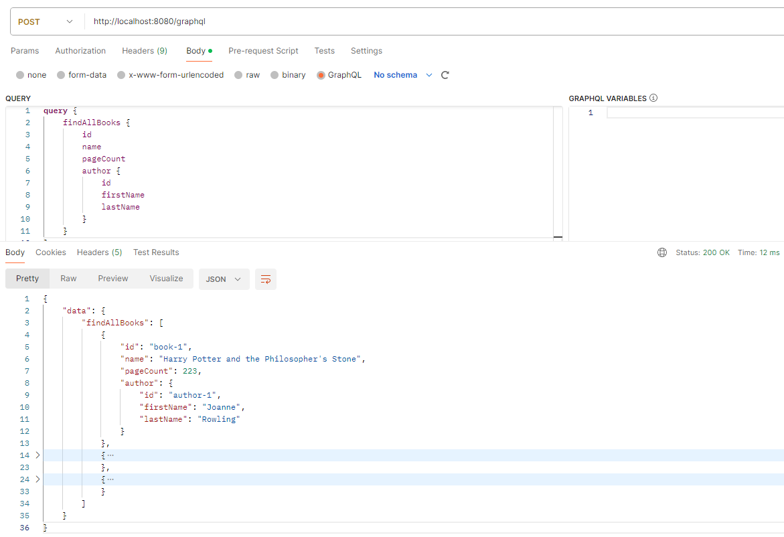
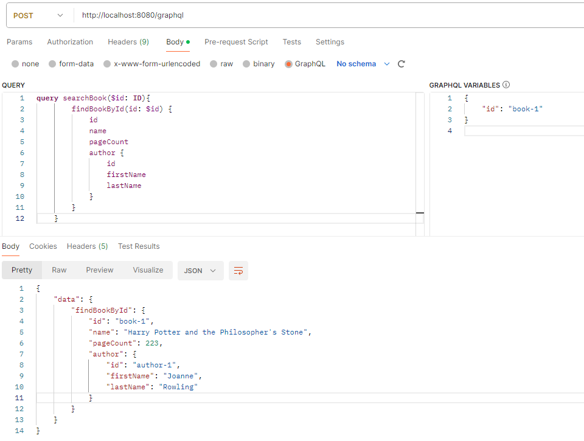

## Spring Graphql

1.start service

run SpringGraphqlApplication.java

2.query

(1) Test With graphiql web
`http://localhost:8080/graphiql?path=/graphql`

(2) Test With Postman (POST)
`http://localhost:8080/graphql`

3.query Sample

(1) findAllBooks

`query {
    findAllBooks {
        id
        name
        pageCount
        author {
            id
            firstName
            lastName
        }
    }
}`

(2) findBookById

`    query {
        findBookById(id: "book-1") {
            id
            name
            pageCount
            author {
                id
                firstName
                lastName
            }
        }
    }`

(3) findBookByIdWithVariables

query:
`query searchBook($id: ID){
    findBookById(id: $id) {
        id
        name
        pageCount
        author {
            id
            firstName
            lastName
        }
    }
}`

variables:
`{
    "id": "book-1"
}
`

(4) findBookByIdWithVariablesRaw

`{
"query": "query searchBook($id: ID){ \n  findBookById(id: $id) { \n id \n name \n pageCount  \n  author { \n  id \n firstName \n  lastName \n   } \n   } \n  }",
"variables": { "id": "book-1" }
}`

